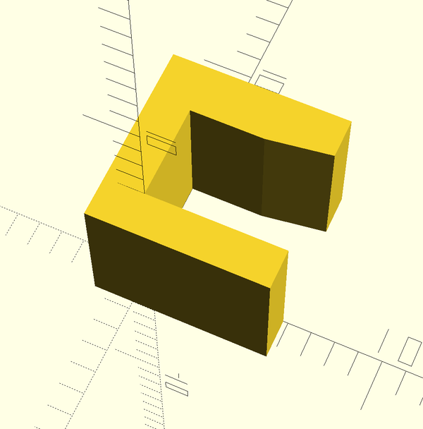
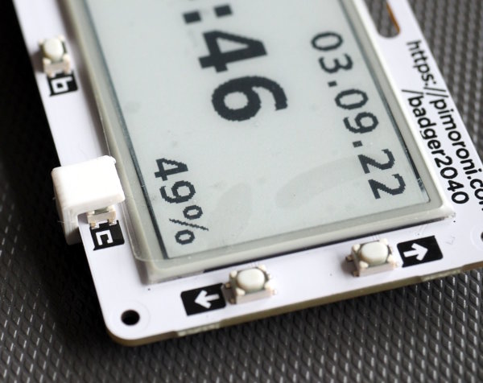

badger2040-button-clamp
=======================

Pimoroni's [Badger2040](https://shop.pimoroni.com/products/badger-2040)
is a nice "intelligent" e-paper display with an integrated RP2040.

The design-decision that a Badger2040 needs a button-press to wake up
when running from battery prevents any time-based applications which
go to sleep and then wake up using a timer.

A small hardware-hack solves the problem if you can do without one of the
buttons. For time-based applications (think "clock") this is usually
the case.

You have two options:

  - solder a small wire across the barely visible legs of one of the
    front buttons, or
  - keep one of the buttons permanently pressed

The first option is best for a permanent solution, the second option
works fine for test and development. If you have a case, you could
also integrate the latter directly into it.

This repository contains the OpenSCAD design files (and STL) for
a little 3D-printed clamp that implements the second option. The clamp
is really small and prints within 4 minutes (PLA, 0.2mm layer hight).

Note that the permanently pressed button does not draw a relevant amount
of current, especially compared to the current-draw of the RP2040 during
sleep (6.8mA).
